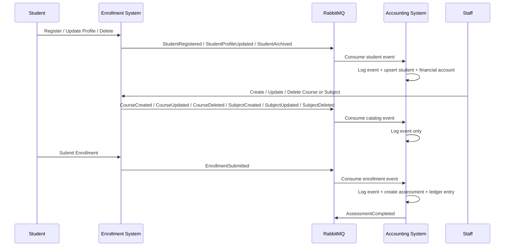

# Enterprise School Enrollment and Accounting Architecture

## System Boundaries

- `Enrollment System`
  - Owns identity, student profiles, admissions, curriculum checks, and enrollment workflow.
  - Writes only to the Enrollment database.
  - Publishes domain events to RabbitMQ.
  - Emits student, course, subject, and enrollment events.

- `Accounting System`
  - Owns financial accounts, assessments, ledgers, payments, and accounting reports.
  - Writes only to the Accounting database.
  - Subscribes to Enrollment events and publishes accounting events back to the bus.
  - Mirrors enrollment-side students, courses, subjects, and enrollments into the Accounting database.
  - Stores an append-only activity log for every incoming enrollment event.

## Event Backbone

- Broker: RabbitMQ
- Exchange: `school.events`
- Pattern: topic exchange
- Message format: versioned JSON envelope

### Envelope Shape

```json
{
  "event_id": "uuid",
  "event_type": "StudentRegistered",
  "event_version": 1,
  "occurred_at": "2026-07-09T00:00:00Z",
  "correlation_id": "uuid",
  "actor": {
    "type": "user",
    "id": 1,
    "name": "Registrar",
    "role": "Registrar"
  },
  "metadata": {
    "producer": "Enrollment System",
    "routing_key": "student.registered",
    "retry_count": 0
  },
  "payload": {}
}
```

## Current Event Map

- `student.registered` -> `StudentRegistered`
- `student.profile.updated` -> `StudentProfileUpdated`
- `student.archived` -> `StudentArchived`
- `course.created` -> `CourseCreated`
- `course.updated` -> `CourseUpdated`
- `course.deleted` -> `CourseDeleted`
- `subject.created` -> `SubjectCreated`
- `subject.updated` -> `SubjectUpdated`
- `subject.deleted` -> `SubjectDeleted`
- `enrollment.submitted` -> `EnrollmentSubmitted`

## Queue Topology

- Main consumer queue: `accounting.events`
- Dead-letter queue: `accounting.events.dlq`
- Retry queue: `accounting.events.retry`
- Retry delay: 30 seconds

## Data Ownership

### Enrollment Database

- users
- student_profiles
- admissions
- academic_programs
- curricula
- academic_years
- semesters
- departments
- courses
- sections
- enrollments
- subject_enrollments
- student_documents
- requirements
- class_schedules
- faculty_assignments
- audit_logs

### Accounting Database

- users
- students
- courses
- subjects
- enrollments
- enrollment_subject
- enrollment_activity_logs
- financial_accounts
- assessments
- assessment_items
- fee_types
- payment_transactions
- payment_methods
- official_receipts
- discounts
- scholarships
- penalties
- installment_plans
- journal_entries
- ledgers
- balance_adjustments
- refunds
- transaction_logs
- accounting_audit_logs
- system_settings

## Workflow Summary



## Next Expansion Modules

- Notification Service
- Student Portal
- Faculty Portal
- Scholarship Service
- Library Service
- Inventory Service
- HR Service
- LMS integration
